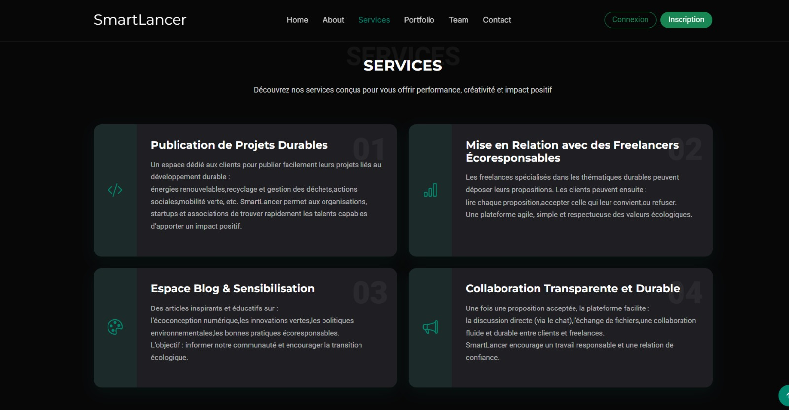

<!-- PROJECT LOGO -->
<br />
<div align="center">
  <a href="https://github.com/votre_nom_utilisateur/SmarLancer">
    
  </a>
<h3 align="center">SmarLancer</h3>
</div>

<!-- TABLE OF CONTENTS -->
<details>
  <summary style="color: Magenta; font-weight: bolder; font-size: 25px ">
    Table of Contents
  </summary>
  <ol>
    <li><a href="#about-the-project">About The Project</a></li>
    <li><a href="#built-with">Built With</a></li>
    <li><a href="#getting-started">Getting Started</a></li>
    <li><a href="#usage">Usage</a></li>
    <li><a href="#contributing">Contributing</a></li>
    <li><a href="#license">License</a></li>
    <li><a href="#contact">Contact</a></li>
  </ol>
</details>

---

## About The Project

**SmarLancer** est une plateforme web de mise en relation entre **clients** et **freelances**, développée en **HTML, CSS, JavaScript et PHP**, avec une base de données MySQL via XAMPP.  
Elle permet de gérer plusieurs fonctionnalités essentielles :  

- **Gestion des utilisateurs et profils**  
- **Gestion des projets et propositions**  
- **Gestion des réclamations et réponses**  
- **Gestion des commentaires et avis**

L’objectif est de fournir une solution simple et intuitive pour trouver et proposer des services freelance tout en gardant une traçabilité des interactions.

---

## Built With

* [HTML5](https://developer.mozilla.org/fr/docs/Web/HTML)  
* [CSS3](https://developer.mozilla.org/fr/docs/Web/CSS)  
* [JavaScript](https://developer.mozilla.org/fr/docs/Web/JavaScript)  
* [PHP](https://www.php.net/)  
* [MySQL](https://www.mysql.com/)  
* [XAMPP](https://www.apachefriends.org/index.html)  

---

## Getting Started

Pour démarrer le projet SmarLancer sur votre machine :

### Prérequis

- Installer [XAMPP](https://www.apachefriends.org/index.html)  
- Avoir un navigateur moderne  
- VS Code pour éditer le code  

### Installation

1. **Cloner le dépôt :**  
   ```sh
   git clone https://github.com/bouraouimariem/SmartLancer


Copier les fichiers dans le dossier htdocs de XAMPP :
Exemple : C:\xampp\htdocs\SmarLancer


Créer la base de données MySQL via phpMyAdmin :
CREATE DATABASE smarlancer;


Configurer le fichier de connexion à la base de données (config.php) :
<?php
$servername = "localhost";
$username = "root";
$password = "";
$dbname = "smarlancer";

$conn = new mysqli($servername, $username, $password, $dbname);

if ($conn->connect_error) {
    die("Connection failed: " . $conn->connect_error);
}
?>


Démarrer Apache et MySQL depuis le XAMPP Control Panel.


Ouvrir le projet dans le navigateur :
http://localhost/SmarLancer/


Usage


Inscription et création de profil utilisateur


Publication et consultation de projets


Envoi et réception de propositions pour des projets


Gestion des réclamations et réponses


Ajout de commentaires et avis pour les projets


Exemple d’images :
<div>
    
    <br/>
    
    <br />
    
    <br />
    


    
</div>

Contributing
Les contributions sont les bienvenues !


Fork le projet


Crée une branche pour votre fonctionnalité (git checkout -b feature/NouvelleFonctionnalite)


Commit vos changements (git commit -m 'Ajout de la fonctionnalité X')


Push sur la branche (git push origin feature/NouvelleFonctionnalite)


Ouvrir une Pull Request


License
Distribué sous la licence MIT. Voir LICENSE.txt pour plus de détails.

Contact
Votre Nom - @VotreTwitter - mariembouraoui2024@gmail.com
bnslimene.raslene15@gmail.com

Project Link:https://github.com/bouraouimariem/SmartLancer


